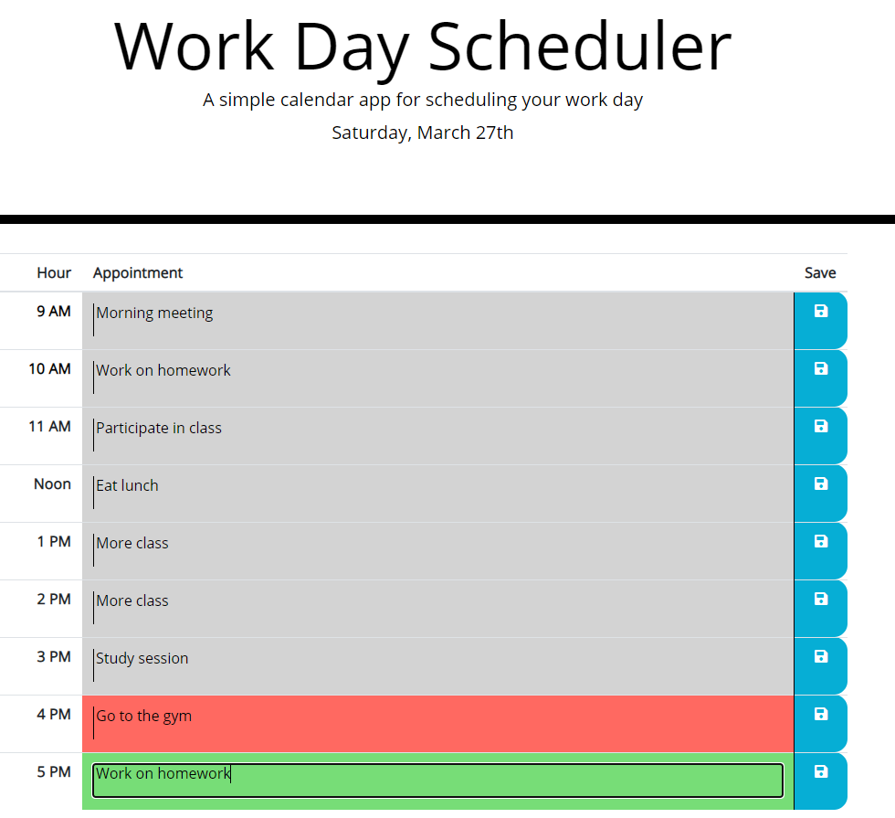

# Work Day Scheduler

This tool displays the current day of the week, month, and day of the month. From 9 AM to 5PM, it allows the user to input text appointments which are saved to local storage for this day. Color coding allows the user to see which appointments are in the past, in the current hour, or in the future.

[Work Day Scheduler Link](https://matthale11.github.io/work-day-scheduler)

